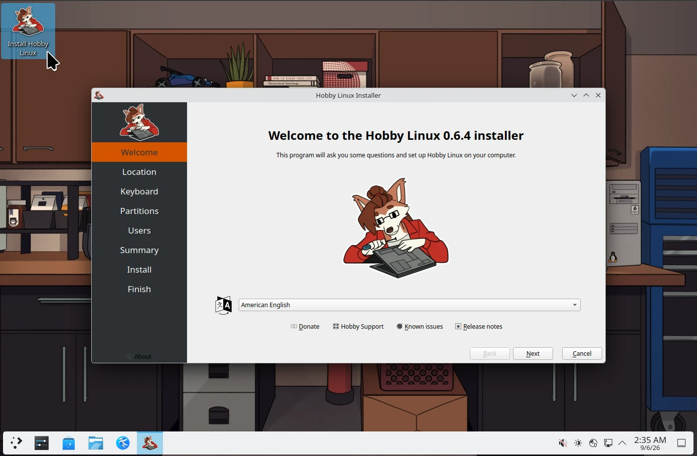

# Hobby Linux

**Hobby Linux** is a Linux distribution built atop Debian Stable (Trixie) with backports enabled. It has a lightweight LXQt desktop with Openbox, and curated goodies for tinkerers.

It’s called Hobby Linux because it lets you explore the machinations of Debian’s `live-build` ecosystem and Calamares installer with your own personal hobby operating system.

---

### Core Defaults

Take a look at the tests under `specs/`. They are unit tests which also help document the code so its easier to get a better picture of what's inside at a glance. Summary:

* **Desktop Environment:** lightweight LXQt and Openbox
* **Firmware & Bootloader:** UEFI w/graphical GRUB and Plymouth spinner-splash screen
* **Filesystem:** XFS w/optional encryption
* **System Configuration:** 
   * **sudo:** standard `sudo`
   * **NetworkManager:** `iwd` w/`systemd-resolved`
   * **AudioServer:** `pipewire`
   * **Drivers:** microcodes, firmwares, & fs progs pre-installed
* **Software Management:** 
  * **System Level:** `nala`
  * **Automated Rolling Maintenance:** `unattended-upgrades` with auto-upgrading packages (not just updating!)

---

## Installation & Workflow

Hobby uses [`task`](https://taskfile.dev/) as the entry point to build a bootable ISO inside an isolated Docker container and spin up a local virtual machine with QEMU.

### Prerequisites

```sh
# Get Task (go-task):
mkdir -p ~/.local/bin
curl -sSL https://github.com/go-task/task/releases/latest/download/task_linux_amd64.tar.gz | tar -xz -C ~/.local/bin task

# Install prereqs:
sudo apt install -y docker.io qemu-system-x86 ovmf
```

---

### Pre-Install

1. **_Build_ the ISO:**
   ```sh
   task iso:build
   ```
   Spins up a Docker container running Debian Trixie with `live-build`, downloads packages, applies customizations, and writes a bootable image to `build/hobbylinux-*.iso`. Takes about ~8 minutes to run.

2. **_Run_ the live ISO in QEMU:**
   ```sh
   task vm:run
   ```
   Launches QEMU in UEFI mode with KVM acceleration. Auto-provisions a virtual test disk (`vm/hobbylinux-test.qcow2`), UEFI NVRAM, and boots the newly built ISO.

---

### Install / Live Desktop



The live desktop is LXQt. To begin the install, launch the **Install Hobby Linux** shortcut. A network connection is required! The installer is `calamares` and uses some fish helper scripts. Follow the install (partition, users, etc.) prompts and reboot when complete.

---

### Post-Install

1. **Boot into the Installed System:**
   ```sh
   task vm:run
   ```

2. **Hobby Linux Bootstrap:**

   An automated setup script opens after login and lets you pick from a list of package groups (Gaming, HTPC, Content Creation, Development). The bootstrap script lets you pre-install groups of packages and flatpaks and runs only at the very first boot.

---

### Artwork & License

* **Code & Configuration:** Licensed under the [MIT License](LICENSE).
* **Artwork & Branding:** All original artwork, wallpapers, and branding assets belong to **Egee** (All rights reserved).
